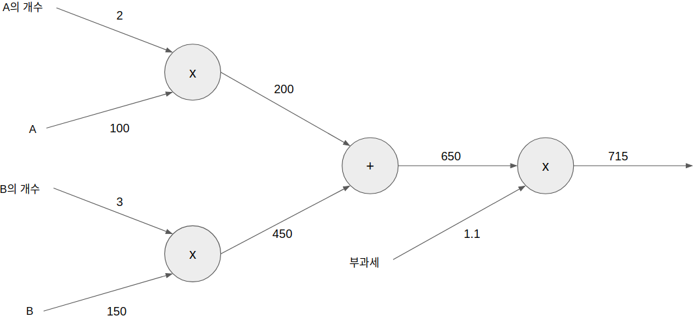
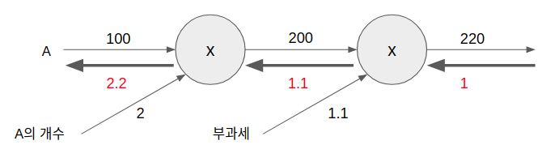
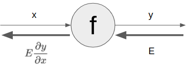
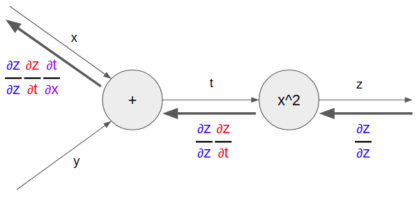

### 역전파 (Back Propagation)

> 가중치 매개변수의 기울기를 효율적으로 계산하는 방법입니다. 먼저 구현했던 수치미분은 구현하기 쉬운반면 속도면에서 많이 느립니다. 이를 개선하기 위해서 오차 역전파 방법을 사용합니다.
>
> 역전파를 보다 쉽게 이해하기 위해 수식보다는 계산 그래프로 설명합니다.

1. 계산 그래프
   1. 정의
      * 계산 과정을 그래프로 표현한 것. 자료구조의 그 그래프와 동일합니다.
      * 복수의 노드(Node)와 엣지(Edge)로 구성 되어 있습니다.
      * 엣지는 노드 사이의 **직선**을 의미 합니다.
        
   2. 국소적 계산
      * 계산 그래프의 특징은 국소적 계산을 전파함으로써 최종 결과를 얻는다는 점에 있습니다.
      * "국소적"이란 말은 **자신과 관계된 작은 범위**란 의미 입니다. 전체와는 상반된 의미 입니다.
      * 위 그래프의 그림에서 A의 개수와 A를 입력 받아 2 x 100을 수행하는 노드 X는 자신과 관계된 입력만 계산하면 된다는 의미입니다. 앞에서 2와 100이 어떻게 왔는지 의미를 두지 않습니다.
      * 이것 처럼 계산 그래프는 국소적인 계산에 집중합니다. 
      * 전체의 계산이 아무리 복잡하다고 해도 국소적인 계산은 단순하기 때문에 각각을 쉽게 계산하고 전체를 전달함으로서 어려운 계산도 해낼 수 있습니다.
   3. 왜 계산 그래프로 푸는가?
      * 첫 번째 장점은 국소적 계산
      * 두 번째 장점은 계산 그래프의 중간 결과를 모두 저장할 수 있습니다
      * 역전파를 통해 '미분'을 효율적으로 계산할 수 있다는 장점이 있습니다.
        
      * 역전파는 순전파의 반대방향으로 굵은 화살표로 표현 합니다.
      * 역전파는 **국소적 미분**을 전달하고 그 미분값을 화살표 아래에 적습니다.
      * 미분 값을 봄으로서 A의 가격이 조금만 올라도 최종적으로는 그 조금 오른 값의 2.2배가 오르게 됩니다.
      * 여기서 A의 개수에 대한 미분과 부과세에 대한 미분도 함께 구할 수 있습니다. 앞선 결과의 계산 값을 공유할 수 있어서 다수의 미분을 효율적으로 계산 할 수 있습니다.
      * 이처럼 계산 그래프의 이점은 순전파와 역전파를 활용해서 각 변수의 미분을 효율적으로 구할 수 있다는 것입니다.

2. 연쇄법칙 (Chain Rule)

   * 계산 그래프의 역전파
     * 앞서 본 국소적 미분, 즉 역전파는 연쇄법칙(Chain Rule)의 규칙을 따른 것입니다.
       
     * 위 그림과 같이 역전파의 계산 순서는 역전파의 최초 신호 E를 노드의 국소적 미분

     $$
     \frac{\partial y}{\partial x}
     $$

     ​	와 곱한 후 다음 노드로 전달 하는 것이다.

     * 여기서의 국소적 미분은 순전파의 y = f(x) 계산의 미분을 구한다는 것이다. 
     * 만약 y = f(x) = x의 제곱일 때 여기의 미분은 2x가 됩니다.
     * 이 2x에 최초 신호 E를 곱하고 그 값을 앞(왼쪽)으로 전달 하는것입니다.

   * 연쇄법칙이란?

     * 합성함수로부터 시작됩니다.
       $$
       z = (x+y)^2
       $$
       식을 아래의 두개의 식으로 구성하게 됩니다.
       $$
       z = t^2 \\
       t = x + y
       $$

     * 연쇄법칙은 합성 함수의 미분에 대한 성질이며 다음과 같이 요약됩니다.

       > 합성 함수의 미분은 합성 함수를 구성하는 각 함수의 미분의 곱으로 나타낼 수 있다.

     * 이를 간단하게 나타내면 아래와 같습니다.
       $$
       \frac{\partial z}{\partial x}=\frac{\partial z}{\partial t}\frac{\partial t}{\partial x}
       $$
       여기서 partial t는 서로 지울 수 있습니다.
       $$
       z=t^2
       $$
       에서
       $$
       \frac{\partial z}{\partial x}
       $$
       의 미분을 구해봅시다.
       $$
       \frac{\partial z}{\partial t}=2t \\
       \frac{\partial t}{\partial x}=1 \\
       \frac{\partial z}{\partial x}=\frac{\partial z}{\partial t}\frac{\partial t}{\partial x}=2t\cdot1=2(x+y)
       $$
       여기서 2t는 t의 제곱에 대하여 미분공식에서 해서적으로 구한 결과 입니다. 

   * 연쇄법칙과 계산 그래프

     * 위의 연쇄법칙 계산을 계산그래프로 나타내 봤습니다.
       

     * 각각의 극소적 미분값은 색으로 구분하여 앞 노드의 값과 현재 노드의 미분값을 곱하여 그 결과를 앞(왼쪽)으로 전달 합니다.

     * 참고로 역전파의 첫 신호인 ∂z/∂z의 값은 1입니다.

     * 여기서 다시한번 주목해야 할 것은
       $$
       \frac{\partial z}{\partial z}\frac{\partial z}{\partial t}\frac{\partial t}{\partial x}=\frac{\partial z}{\partial t}\frac{\partial t}{\partial x}=\frac{\partial z}{\partial x}
       $$
       왼쪽의 역전파인데 연쇄법칙에 의해 **x에 대한  z의 미분**이 된다.

3. 역전파 (Back Propagation)
   1. 덧셈 노드
   2. 곱셈 노드

4. 코드로 구현하기
   1. 덧셈 계층
   2. 곱셈 계층
   3. 활성화 함수 계층
      1. ReLU
      2. Sigmoid
   4. Affine/Softmax 계층
      1. Affine
      2. Softmax
   5. Batch Affine 계층
   6. Softmax with Loss 계층

5. 최종 구현

6. 테스트