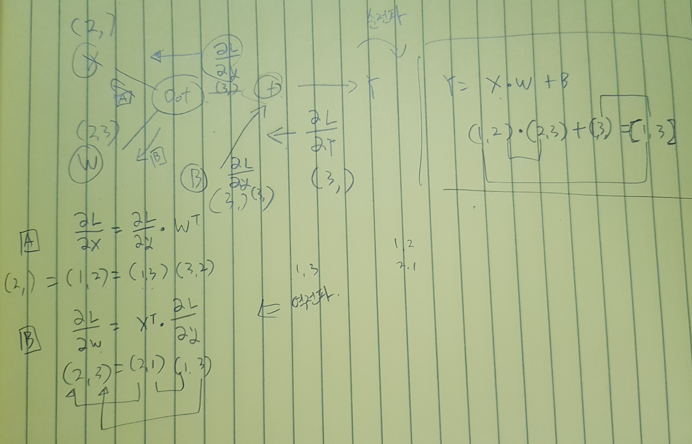

### 역전파 (Back Propagation)

> 가중치 매개변수의 기울기를 효율적으로 계산하는 방법입니다. 먼저 구현했던 수치미분은 구현하기 쉬운반면 속도면에서 많이 느립니다. 이를 개선하기 위해서 오차 역전파 방법을 사용합니다.
>
> 역전파를 보다 쉽게 이해하기 위해 수식보다는 계산 그래프로 설명합니다.


1. 계산 그래프
   1. 정의
      * 계산 과정을 그래프로 표현한 것. 자료구조의 그 그래프와 동일합니다.
      * 복수의 노드(Node)와 엣지(Edge)로 구성 되어 있습니다.
      * 엣지는 노드 사이의 **직선**을 의미 합니다.
        
   2. 국소적 계산
      * 계산 그래프의 특징은 국소적 계산을 전파함으로써 최종 결과를 얻는다는 점에 있습니다.
      * "국소적"이란 말은 **자신과 관계된 작은 범위**란 의미 입니다. 전체와는 상반된 의미 입니다.
      * 위 그래프의 그림에서 A의 개수와 A를 입력 받아 2 x 100을 수행하는 노드 X는 자신과 관계된 입력만 계산하면 된다는 의미입니다. 앞에서 2와 100이 어떻게 왔는지 의미를 두지 않습니다.
      * 이것 처럼 계산 그래프는 국소적인 계산에 집중합니다. 
      * 전체의 계산이 아무리 복잡하다고 해도 국소적인 계산은 단순하기 때문에 각각을 쉽게 계산하고 전체를 전달함으로서 어려운 계산도 해낼 수 있습니다.
   3. 왜 계산 그래프로 푸는가?
      * 첫 번째 장점은 국소적 계산
      * 두 번째 장점은 계산 그래프의 중간 결과를 모두 저장할 수 있습니다
      * 역전파를 통해 '미분'을 효율적으로 계산할 수 있다는 장점이 있습니다.
        
      * 역전파는 순전파의 반대방향으로 굵은 화살표로 표현 합니다.
      * 역전파는 **국소적 미분**을 전달하고 그 미분값을 화살표 아래에 적습니다.
      * 미분 값을 봄으로서 A의 가격이 조금만 올라도 최종적으로는 그 조금 오른 값의 2.2배가 오르게 됩니다.
      * 여기서 A의 개수에 대한 미분과 부과세에 대한 미분도 함께 구할 수 있습니다. 앞선 결과의 계산 값을 공유할 수 있어서 다수의 미분을 효율적으로 계산 할 수 있습니다.
      * 이처럼 계산 그래프의 이점은 순전파와 역전파를 활용해서 각 변수의 미분을 효율적으로 구할 수 있다는 것입니다.

2. 연쇄법칙 (Chain Rule)

   * 계산 그래프의 역전파
     * 앞서 본 국소적 미분, 즉 역전파는 연쇄법칙(Chain Rule)의 규칙을 따른 것입니다.
       
     * 위 그림과 같이 역전파의 계산 순서는 역전파의 최초 신호 E를 노드의 국소적 미분

     $$
     \frac{\partial y}{\partial x}
     $$

     ​	와 곱한 후 다음 노드로 전달 하는 것이다.

     * 여기서의 국소적 미분은 순전파의 y = f(x) 계산의 미분을 구한다는 것이다. 
     * 만약 y = f(x) = x의 제곱일 때 여기의 미분은 2x가 됩니다.
     * 이 2x에 최초 신호 E를 곱하고 그 값을 앞(왼쪽)으로 전달 하는것입니다.

   * 연쇄법칙이란?

     * 합성함수로부터 시작됩니다.
       $$
       z = (x+y)^2
       $$
       식을 아래의 두개의 식으로 구성하게 됩니다.
       $$
       z = t^2 \\
       t = x + y
       $$

     * 연쇄법칙은 합성 함수의 미분에 대한 성질이며 다음과 같이 요약됩니다.

       > 합성 함수의 미분은 합성 함수를 구성하는 각 함수의 미분의 곱으로 나타낼 수 있다.

     * 이를 간단하게 나타내면 아래와 같습니다.
       $$
       \frac{\partial z}{\partial x}=\frac{\partial z}{\partial t}\frac{\partial t}{\partial x}
       $$
       여기서 partial t는 서로 지울 수 있습니다.
       $$
       z=t^2
       $$
       에서
       $$
       \frac{\partial z}{\partial x}
       $$
       의 미분을 구해봅시다.
       $$
       \frac{\partial z}{\partial t}=2t \\
       \frac{\partial t}{\partial x}=1 \\
       \frac{\partial z}{\partial x}=\frac{\partial z}{\partial t}\frac{\partial t}{\partial x}=2t\cdot1=2(x+y)
       $$
       여기서 2t는 t의 제곱에 대하여 미분공식에서 해서적으로 구한 결과 입니다. 

   * 연쇄법칙과 계산 그래프

     * 위의 연쇄법칙 계산을 계산그래프로 나타내 봤습니다.
       

     * 각각의 극소적 미분값은 색으로 구분하여 앞 노드의 값과 현재 노드의 미분값을 곱하여 그 결과를 앞(왼쪽)으로 전달 합니다.

     * 참고로 역전파의 첫 신호인 ∂z/∂z의 값은 1입니다.

     * 여기서 다시한번 주목해야 할 것은
       $$
       \frac{\partial z}{\partial z}\frac{\partial z}{\partial t}\frac{\partial t}{\partial x}=\frac{\partial z}{\partial t}\frac{\partial t}{\partial x}=\frac{\partial z}{\partial x}
       $$
       왼쪽의 역전파인데 연쇄법칙에 의해 **x에 대한  z의 미분**이 된다.

3. 역전파 (Back Propagation)
   1. 덧셈 노드

      * z = x + y 식을 대상으로 역전파의 덧셈을 보면서 각 미분을 계산해보면 다음과 같습니다.
        $$
        \frac{\partial z}{\partial x}=1 \\
        \frac{\partial z}{\partial y}=1
        $$

      * 덧셈노드의 역전파는 입력 값을 그대로 흘려보낸다.

      * 오른쪽에서 전해진 미분에 1을 곱하여 왼쪽으로 전달 합니다.

   2. 곱셈 노드

      * z = xy 식을 대상으로 역전파의 곱셈을 보면 아래와 같은 미분을 해석적으로 얻을 수 있습니다.
        $$
        \frac{\partial z}{\partial x}=y \\
        \frac{\partial z}{\partial y}=x
        $$

      * 곱셈 노드는 오른쪽에서 전달된 미분값을 순전파 계산때의 입력 신호값을 서로 바꾼 값으로 곱하여 왼쪽으로 전달 합니다. 

4. 코드로 구현하기
   1. 덧셈 계층

      * code

        ```python
        import numpy as np
        
        class AddLayer:
            def __init__(self):
                pass
            
            def forward(self, x, y):
                return x + y
        
            def backward(self, dout):
                dx = dout * 1
                dy = dout * 1
                return dx, dy
        ```

   2. 곱셈 계층

      * code

        ```python
        import numpy as np
        
        class MulLayer:
            def __init__(self):
                self.x = None
                self.y = None
        
            def forward(self, x, y):
                self.x = x
                self.y = y
                return x * y
        
            def backward(self, dout):
                # 곱셈 노드의 역전파는 서로 반대편의 순전파 값을 곱하여 전달 합니다.
                dx = dout * self.y
                dy = dout * self.x
                return dx, dy
        ```

   3. 활성화 함수 계층
      1. ReLU

         * 수식
           $$
           y= 
           \begin{cases}
               x  & (x \gt 0)\\
               0  & (x \le 0)
           \end{cases}
           $$

         * 여기서 x에 대한 y의 미분은 다음과 같다
           $$
           \frac{\partial y}{\partial x}= 
           \begin{cases}
               1  & (x \gt 0)\\
               0  & (x \le 0)
           \end{cases}
           $$

         * 위 미분식을 보면 ReLU로 들어온 순전파의 입력인 x가 0보다 크면 오른쪽에서 전달되는 역전파의 입력을 그대로 왼쪽으로 전달 합니다.

         * 반면 순전파의 입력 x가 0이하이면 역전파 때의 신호는 하류로 보내지 않습니다. (0을 전달)

         * code

           ```python
           import numpy as np
           
           class ReLU:
               def __init__(self):
                   self.mask = None
           
               def forward(self, x):
                   self.mask = (x <= 0)
                   out = x.copy()
                   out[self.mask] = 0 # mask에서 True인 위치의 요소만 가져와 배열로 만든다.
                   return out
           
               def backward(self, dout):
                   dout[self.mask] = 0
                   dx = dout
                   return dx
           ```

           

      2. Sigmoid

         * 수식
           $$
           y=\frac{1}{1+exp(-x)}
           $$

         * 삽화와 수식이 많이 필요하여 간소하게 설명합니다.

         * 계산그래프

           * y=exp(x)의 미분은 exp(x) 입니다.
           * y=1/x의 미분은 -1/x^2 입니다.

         * 순전파 (계산 그래프로 상상합니다.)

           * 1단계: x에 -1을 곱합니다.
           * 2단계: 1단계 -x에 exp(x)를 합니다. 여기서는 exp(-x)가 됩니다. (이 노드의 계산은 y=exp(x))
           * 3단계: 2단계 exp(-x)에 1을 덥합니다. 즉 1+exp(-x)가 됩니다.
           * 4단계: 3단계의 1+exp(-x)로 1을 나눕니다. 최종 y가 출력 됩니다. (이 노드의 계산은 y=1/x)

         * 역전파 (역으로 미분을 계산합니다.)

           * Sigmoid의 역전파 입력은 마찬가지로 다음기호를 사용합니다.
             $$
             \frac{\partial L}{\partial y}
             $$

           * 1단계: 순전파 4단계의 y=1/x의 미분을 구합니다. (Reciprocal Rule 사용)
             $$
             \frac{\partial y}{\partial x}=-\frac{1}{x^2} 
             = -\frac{1}{(1+exp(-x))^2}
             = -y^2
             $$
             여기에 상류(오른쪽)에서 전달 된 미분값을 곱하여 하류(왼쪽)으로 전달합니다.
             $$
             -\frac{\partial L}{\partial y}y^2
             $$

           * 2단계: 덧셈 노드는 앞서 배운대로 1을 곱하여 하류로 전달 합니다.

           * 3단계: y=exp(x) 노드의 미분을 구합니다.
             $$
             \frac{\partial L}{\partial y}=exp(x)
             $$
             이 노드의 미분인 exp(x)를 상류에서 전달된 값에 곱합니다.
             $$
             -\frac{\partial L}{\partial y}y^2exp(-x)
             $$

           * 4단계: 곱셈 노드는 순전파의 반대 값을 곱합니다. 여기서는 -1입니다. (순전파 1단계 참고)
             $$
             -1\cdot-\frac{\partial L}{\partial y}y^2exp(-x) \\
             =\frac{\partial L}{\partial y}y^2exp(-x)
             $$

           * 이처럼 Sigmoid 계층의 역전파의 최종출력을 구하였습니다. 이 역전파의 식을 보면 순전파의 출력과 입력만으로 Sigmoid의 역전파를 쉽게 계산할 수 있습니다. 

           * 여러단계의 과정을 Sigmoid 계층에서는 저렇게 간소화 할 수 있습니다. 간소화는 즉 성능과 연결되며 더 효율적이라고 할 수 있습니다.

           * 여기서 더 나아가 위 역전파 출력을 다음처러 정리 할 수 있습니다.
             $$
             \frac{\partial L}{\partial y}y^2exp(-x)=\frac{\partial L}{\partial y}\frac{1}{(1+exp(-x))^2}exp(-x) \\
             =\frac{\partial L}{\partial y}\frac{1}{1+exp(-x)}\frac{exp(-x)}{1+exp(-x)} \\
             =\frac{\partial L}{\partial y}y(1-y)
             $$

           * 정리한 역전파 형태를 보면 순전파의 최종 출력 값만으로 Sigmoid 계층의 역전파를 구할 수 있습니다. 좀 멋지죠?

           * code

             ```python
             import numpy as np
             
             class Sigmoid:
                 def __init__(self):
                     self.out = None
             
                 def forward(self, x):
                     self.out = 1 / (1+np.exp(-x))
                     return self.out
             
                 def backward(self, dout):
                     dx = dout * (self.out*(1.0-self.out))
                     return dx
             ```

             

   4. Affine/Softmax 계층
      1. Affine

         * 신경망의 순전파에서는 가중치 신호의 총합을 계산하기 때문에 행렬의 내적(np.dot)을 사용하여 계산하였습니다. 행렬의 내적은 각 요소의 차원의 수를 일치 시켜야 합니다.

         * X, W, B의 차원 수는 (2,), (2, 3), (3)으로 일치 하여야 합니다.

         * code

           ```python
           >>> import numpy as np
           >>> X = np.random.rand(5, 2)
           >>> W = np.random.rand(2, 3)
           >>> B = np.random.rand(3)
           >>> Y = np.dot(X, W) + B
           >>> X.shape
           (5, 2)
           >>> W.shape
           (2, 3)
           >>> B.shape
           (3,)
           >>> Y = np.dot(X, W) + B
           >>> Y.shape
           (5, 3)
           ```

         * 이러한 행렬의 내적은 기하학에서는 어파인 변환(Affine Transformation)이라고 합니다.

         * 내적의 역전파
           $$
           \frac{\partial L}{\partial X}=\frac{\partial L}{\partial Y} \cdot W^T \\
           \frac{\partial L}{\partial W}=X^T \cdot \frac{\partial L}{\partial Y}
           $$

         * 순전파의 입력인 X와 W의 전치행렬(Transpose)를 이용하여 상류로 부터 전달된 입력값으로 미분을 구한다.
           

         * 참고로 행렬 내적의 역전파는 행렬의 대응하는 차원의 원소 수가 일치하도록 내적을 조립하여 구할 수 있다.

      2. Batch Affine 계층

         * 배치용 Affine 계층은 앞서 설명한 부분과 동일하다. 다만 순전파의 입력 X 단일만을 고려했으나 이를 배치(묶음)으로된 순전파에 대한 역전파를 생각해보겠습니다.

         * 기존 X는 (2,)의 차원 형태를 가졌습니다. 배치형태는 (N, 2)의 형태로 볼 수 있습니다.
           

         * **박스 A**는 순전파 X의 대한 역전파입니다. **박스 B**는 순전파 W의 대한 역전파 입니다.

         * **박스 C**는 Bias(편향)에 대한 역전파입니다.

         * 편향의 역전파는 출력 Y의 미분인 값을 **0번째 축으로 모두 더한 값**을 구하는 것입니다.

         * code

           ```python
           >>> import numpy as np
           >>> dY = np.array([[1,2,3],[4,5,6]])
           >>> dY
           array([[1, 2, 3],
                  [4, 5, 6]])
           
           >>> dB = np.sum(dY, axis=0)
           >>> dB
           array([5, 7, 9])
           ```

           ```python
           import numpy as np
           
           class Affine:
               def __init__(self, W, B):
                   self.W = W
                   self.B = B
                   self.x = None
                   self.dW = None
                   self.db = None
           
               def forward(self, x):
                   self.x = x
                   return np.dot(x, self.W) + self.B
           
               def backward(self, dout):
                   dx = np.dot(dout, self.W.T)
                   self.dW = np.dot(self.x.T, dout)
                   self.db = np.sum(dout, axis=0)
                   return dx
           ```

      3. Softmax with Loss 계층

5. 최종 구현

6. 테스트