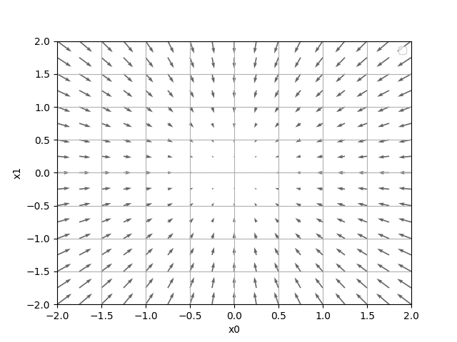
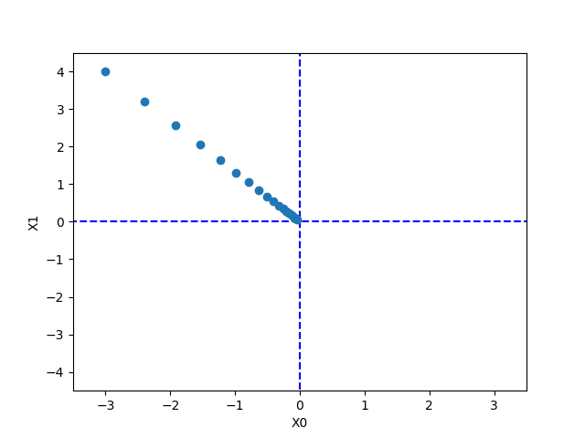

### 기울기 (Gradient)

- 식
  $$
  (\frac{\partial f}{\partial x_0},\frac{\partial f}{\partial x_1})
  $$
  위 식처럼 모든 변수의 편미분을 <u>벡터(vector)</u>로 정리한 것을 **기울기(gradient)**라고 한다.

- code

  ```python
  import numpy as np
  
  def numerical_gradient(f, x):
      h = 1e-4
      h2 = 2*h
      grad = np.zeros_like(x) #x랑 같은 크기의 배열을 생성하고 0으로 초기화
      
      for idx in range(x.size):
          tmp_val = x[idx] 
          x[idx] = tmp_val + h # f(x+h)
          fxh1 = f(x) # x를 제외한 나머지는 상수로 두고 기울기를 계산
          
          x[idx] = tmp_val - h # f(x-h)
          fxh2 = f(x) # 마찬가지
          
          grad[idx] = (fxh1 - fxh2) / h2 # 중앙차분으로 기울기를 구함
          x[idx] = tmp_val # 복원
          
      return grad
  ```

- [2, 324] 형태의 x에 대한 기울기
  식
  $$
  f(x_0, x_1) = x_0^2+x_1^2
  $$
  의 기울기는 아래 그림과 같다.

  

- 기울기는 위 그림처럼 바향을 가진 벡터로 표현된다.

- 기울기는 "가장 낮은 장소(최솟값)"을 가리키는거와 같다.

- 가장 작은 중심으로 부터 멋 곳은 화살표가 크다. 이는 기울기가 크다와 같다.

- 하지만 중요한건 이처럼 기울기가 가리기는 방향이 항상 가장 낮은 장소만을 가리키고 있지는 않다.

- 저기 말고 다른 어딘가에 더 낮은 곳을 가리키는 기울기가 존재 할 수 있다.

- 이러한 이유때문에 여러 종류에 Optimizer가 있다. 추후에 보자

- 중요: **기울기가 가리키는 쪽은 각 장소에서 함수의 출력 값을 가장 크게 줄이는 방향 이다.**


1. **경사 하강법(Gradient Descent)**

   - 경사법은 현 위치에서 기울어진 방향으로 일정 거리만큼 이동하여 최솟값(극소값)을 찾는 기계학습의 최적화 기법중에 하나다.

   - 경사법은 경사 하강법, 경사 상승법 두가지가 있다. 보통은 경사 하강법을 말한다.

   - 식
     $$
     x_0=x_0-\eta\frac{\partial f}{\partial x_0}, x_1=x_1-\eta\frac{\partial f}{\partial x_1}
     $$

   - 기호 n은 에타(eta)로 학습률(Learning Rate)를 나타낸다. 즉 얼마만큼 학습해야 할지, x값을 얼마나 갱신해야 하는것을 결정한다.

   - code

     ```python
     import numpy as np
     
     def gradient_descent(f, init_x, lr=0.01, step_num=100):
         x = init_x
         
         for i in range(step_num):
             grad = numerical_gradient(f, x)
             x -= lr * grad
             
         return x
     ```

     

   - 위 그림은 초기값을 (-3, 4)로 설정하고 최솟값을 경사하강법으로 탐색한 과정을 나타낸다.

   - 여기서 학습률은 매우 중요하다.

     - 너무 크면 발산하여 엄청크거나 표현할 수 없는 수가 되어버린다.
     - 너무 작으면 거의 갱신되지 않은 채 끝나버린다.

2. **신경망의 기울기**

   - 그럼 신경망에서도 기울기를 구해야 한다. 어떤 기울기를 구해야 할까?

   - 가중치(Weight)에 대한 손실 함수(Loss Function)의 기울기를 구해야 한다.

   - (2, 3)의 형태의 가중치 W와 손실 함수 L이 있다면 다음 수식으로 나타낸다
     $$
     W = 
     \begin{pmatrix}
     w_{11} w_{12} w_{13} \\
     w_{21} w_{22} w_{23}
     \end{pmatrix}
     $$

     $$
     \frac{\partial L}{\partial W}=
     \begin{pmatrix}
     \frac{\partial L}{\partial W_{11}}
     \frac{\partial L}{\partial W_{12}}
     \frac{\partial L}{\partial W_{13}} \\
     \frac{\partial L}{\partial W_{21}}
     \frac{\partial L}{\partial W_{22}}
     \frac{\partial L}{\partial W_{23}}
     \end{pmatrix}
     $$

   - 위의 각각의 원소에 관한 편미분이다. 

   - 예를 들어 1행 1번째 원소인 w_{11}을 조금 변경했을 때 손실함수 L이 얼마나 변화하느냐를 나타낸다.

   - 간단한 신경망 code를 보자

     ```python
     class simpleNet:
         def __init__(self):
             self.W = np.random.randn(2,3)
     
         def predict(self, x):
             return np.dot(x, self.W)
     
         def loss(self, x, t):
             z = self.predict(x)
             y = softmax(z)
             loss = cross_entropy_error(y, t)
     
             return loss
     ```

   - simpleNet의 loss함수 즉 손실함수의 기울기를 구하는것이다. 

     ```python
     x = np.array([0.6, 0.9])
     t = np.array([0, 0, 1])
     
     net = simpleNet()
     print(net.W)
     >>> [[0.19628444 -0.79478232  1.45904177]
          [0.27076211  0.01052753  0.49565257]]
     
     f = lambda w: net.loss(x, t)
     dW = numerical_gradient(f, net.W)
     ```

   - W는 정규분포로 초기화 하고

   - x는 0.6, 0.9이고 정답은 [0,0,1] (one-hot encoding)로 되어 있다.

   - 함수 f는 simpleNet에 있는 W를 가지고 입력 x에 대하여 정답 t와 CEE를 통하여 loss를 구한다. 
     이때 numerical_gradient는 함수 f대하여 simpleNet.W 각 요소의 기울기를 구하는 것이다.

   - simpleNet의 W의 각각 요소의 기울기를 구한 것이 dW이다.

     ```python
     print(dW)
     >>> dW = [[ 0.14820694  0.06469982 -0.21290676]
               [ 0.22231041  0.09704972 -0.31936014]]
     ```
