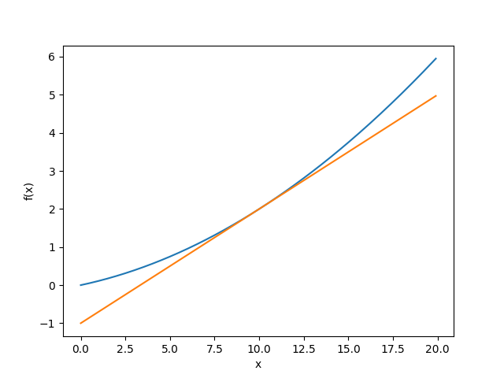

### 신경망 학습 (Neural-Net Training)


> 학습이란? 훈련 데이터로 부터 신경망의 가중치(weight)를 값을 최적화 하는 것을 말합니다.
>
> 여기서 신경망 학습의 중요한 지표인 손실함수(Loss Function)을 이해해야 합니다.

> 목표: 신경망의 학습 방법, 즉 데이터에서 매개변수를 경정하는 방법을 알아보자


* 기계학습은 데이터 주도 학습이다. 사람의 생각하는 알고리즘등에서 벗어난 데이터를 중심으로 접근하는 방법입니다. 이것의 의미하는것은 어떤 예측 기능을 구현함에 있어 사람이 설계한 알고리즘과 사람의 생각과 추론으로 만든 방법으로 그 기능을 수행하는 것이 아니라 기계가 해당하는 데이터를 기반하여 스스로 최적의 값을 찾는것으로 사람의 생각부분을 제거 한다는데 있습니다. 
* 정리하면 기계학습은 사람의 개입을 최소화하고 수집한 데이터로부터 패턴을 찾으려고 하는 것입니다. 


1. 데이터

   * 데이터는 2종류로 구별하여 사용합니다.
     * 훈련용 데이터 (Training Data)
     * 시험 데이터 (Test Data)
   * 구분하는 이유
     * 범용 능력을 제대로 평가하기위해서
     * 학습한 모델이 훈련용 데이터에 과도하게 맞춰질 경우 실제 적요에서는 엉망의 결과를 나타낼 수 있습니다. 이런경우를 오버피팅(Overfitting)이라고 합니다.

2. **손실 함수 (Loss Function)**

   * 손실 함수는 신경망에서 **나쁨**을 나타내는 지표로, 현재의 신경망이 훈련데이터를 얼마나 잘 처리하지 못하냐에 대한 지표입니다.

   * 종류

     * 평균 제곱 오차 (Mean Square Error, MSE)
     * 교차 엔트로피 오차 (Cross Entropy Error, CEE)

   * 평균 제곱 오차 (MSE)

     * 식
       $$
       E = \frac{1}{2} \sum_{k}(y_k-t_k)^2
       $$

     * code

       ```python
       import numpy as np
       
       def mean_squared_error(y, t):
           return 0.5 * np.sum( (y-t)**2 )
       ```

     * t는 one-hot encoding으로 된 정답

     * y는 predict에서 출력한 예측 값

     * 정답과 예측값을 차이에 대한 제곱이 전체 평균 값을 사용

     * 정답과 다른 잘못된 값을 예측하면 당연히 error는 크기 때문에 MSE의 결과도 크다.

   * 교체 엔트로피 오차 (CEE)

     * 식
       $$
       E = -\sum_{k}t_k\log{y_k}
       $$

     * code

       ```python
       import numpy as np
       
       def cross_entropy_error(y, t):
           delta = 1e-7
           return -np.sum(t * np.log(y+delta))
       ```

     * t는 one-hot encoding으로 된 정답

     * t를 곱하기 때문에 정답이 아닌 값은 0으로 곱하여 사라진다.

     * 정답에 해당하는 one-hot encoding 위치만 1이기 때문에 해당 위치의 값이 절대적으로 크게 나타난다. 

     * 역시 Error에 대한 지표이기 때문에 예측결과가 틀리면 CEE의 결과도 크다.

3. 미니 배치 학습 (Mini-Batch)

   * 배치(Batch)는 묶음 단위다. 

   * 학습에서 다수개의 훈련 이미지에 대하여 1개식 손실 함수를 구하고 그 값을 최대한 줄여주는 매개변수를 찾게 된다. 이것을 학습 이미지가 10000개라면 10000번 하게 된다.

   * 이렇게 일일이 손실함수를 구하는것은 현실적이지 않기에 데이터 일부를 추려서 근사치로 이용하는 방법을 사용한다. 

   * 이렇게 훈련 데이터의 일부만 골라 학습을 수행할 때 이 일부를 미니배치(Mini-Batch)라 한다.

   * 미니 배치용 교체 엔트로피

     * 식
       $$
       E = -\frac{1}{N}\sum_{n}\sum_{k}t_{nk}\log{y_{nk}}
       $$

     * code

     * one-hot encoding 으로 입력 받는 경우 ex) [0, 0, 0, 1]

       ```python
       import numpy as np
       
       def cross_entropy_error_by_onehot(y, t):
           if y.ndim == 1:
               t = t.reshape(1, t.size)
               y = y.reshape(1, y.size)
       
           batch_size = y.shape[0]
           return -np.sum(t * np.log(y)) / batch_size
       ```

       - 정답과 결과가 1차원 배열인경우 2차원 배열로 만든다.
       - 각각의 CEE를 구하고 batch_size로 평균을 구한다.

     * 숫자 레이블로 입력 받는 경우 ex) 3

       ```python
       import numpy as np
       
       def cross_entropy_error_by_index(y, t):
           if y.ndim == 1:
               t = t.reshape(1, t.size)
               y = y.reshape(1, y.size)
       
           batch_size = y.shape[0]
           return -np.sum(np.log(y[np.arange(batch_szie), t])) / batch_size
       ```

     * 마찬가지로 입력된 정답과 결과과 1차원 배열인경우 2차원 배열로 만든다. 

     * y[np.arange(batch_size), t]는 np.arange로 인덱스를 만들고 각 인덱스별 t의 위치에 해당하는 값만 가지고 와서 log를 구한다. 나머지 부분은 무시

4. **손실 함수를 구하는 목적** (정확도를 학습 지표로 사용하지 않는 이유)

   * 이유는 신경망 학습에서 사용하는 미분에 있다.

   * 가중치의 최적의 매개변수값을 찾는데 손실 함수의 값을 가장 적게 하는 매개변수를 찾는다. 

   * 이 과정에서 매개변수의 미분(기울기)을 구한다. 이 미분값을 단서로 매개변수의 값을 서서히 갱신하는 과정을 반복한다.

   * 가령 어떤 신경망에서 특정 매개변수를 주목한다고 하자. 이때 그 가중치 매개변수의 손실 함수의 미분이란 '가중치 매개변수의 값을 변경했을 때 손실함수의 값이 어떻게 변하는가'의 의미이다.

   * 만약 이 미분값이 음수이면 그 가중치를 양의 방향으로 변화시켜 손실 함수의 값을 줄일 수 있다.

   * 반대로 그 미분값이 양수이면 가중치를 음의 방향으로 변화시켜 손실 함수의  값을 줄일 수 있다.

   * 만약 그 미분값이 0이 된다면 그 가중치는 어느방향으로 움직여도 손실 함수의 값은 달라지지 않는다. 그러면 그 가중치 매개변수의 갱신은 거기서 멈춘다.

   * > 정확도를 지표로 하면 매개변수의 미분이 대부분의 장소에서 0이 되기 때문에 정확도를 지표로 사용하면 안된다. 정확도는 매개변수의 미소한 변화에 대하여 거의 반응을 보이지 않고, 반응이 있더라도 그 값이 불연속적으로 갑자기 변화한다.

5. **수치 미분**

   1. 미분

      * 시간공간속에서 어느 순간의 변화량(기울기)를 구하는 것이다.

      * 식
        $$
        \frac{df(x)}{dx}=\lim_{h\to0}\frac{f(x+h)-f(x)}{h}
        $$

      * 해석적(analytic) 미분

        * 진정한 미분 (우리가 교과서에서 배우던..)
        * 어느 순간! 그 순간의 기울기
        * x^2은 2x와 같이 해석적인 풀이로 얻는 것

      * 수치(numerical) 미분

        * 컴퓨터로 가능한한 작은 단위의 두 지점의 기울기(차)로 구한다.

        * 전방 차분

          * 예)
            $$
            \lim_{h\to0}\frac{f(x+h)-f(x)}{h}
            $$

          * code

            ```python
            import numpy as np
            
            def numerical_diff(f, x):
                h = 1e-4 # 0.0001
                return (f(x+h)-f(x))/h
            ```

        * 중앙 차분

          * 예)
            $$
            \lim_{h\to0}\frac{f(x+h)-f(x-h)}{2h}
            $$

          * code

            ```python
            import numpy as np
            
            def numerical_diff(f, x):
                h = 1e-4 # 0.0001
                return (f(x+h)-f(x-h))/(2*h)
            ```

        * 오차를 가급적 줄이기 위해 중앙 차분을 이용한다. 

        * 컴퓨터에서는 부동소수점 반올림 오차로 인해서 무한정 작은 단위의 h를 사용할 수 없다. 

          ```python
          >>> np.float32(1e-0) #반올림 오차가 발생한다. 
          0.0
          ```

        * 대체로 h를 0.0001로 하면 좋은 결과를 얻는다고 한다.

        * 수치미분

          * 예

          $$
          y=0.01x^2+0.1x
          $$

          * 그래프 x가 10일때
            

   2. 편미분

      * 함수의 변수가 2개 이상일 경우 각각의 변수를 개별로 하여 나머지 변수는 상수로 하고 기울기를 구한다.

      * 예)
        $$
        f(x_0, x_1)=x_0^2+x_1^2
        $$

        ```python
        def multival_function(x):
            return x[0]**2 + x[1]**2
        ```

      * 위와 같은 함수가 있고 여기서 x0는 3, x1은 4일 때, **x0**에 대한 편미분을 구하라

        ```python
        >>> def multival_function(x0):
               return x0**2 + 4**2 # x1인 4는 상수가 된다. 
        
        >>> numerical_diff(multival_function, 3.0)
        6.00000000000...
        ```

      * 위와 같은 함수가 있고 여기서 x0는 3, x1은 4일 때, **x1**에 대한 편미분을 구하라

        ```python
        >>> def multival_function(x1):
               return 3**2 + x1**2 # x0인 3은 상수가 된다. 
        
        >>> numerical_diff(multival_function, 4.0)
        7.99999999999...
        ```

      * 이처럼 다변수일 때 구하고자 하는 변수를 제외한 다른 변수를 상수로 두고 구하고자 하는 변수에 대한 기울기를 구하는것이 편미분 이다.

   3. 기울기 (Gradient)


